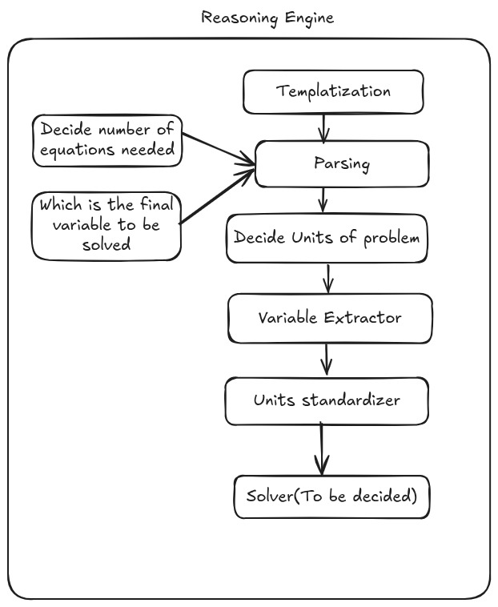

# 🧮 Word Problem Solver - LLM Agent Research

## 🚀 Quick Start

```bash
# Run with your own problem
python3 main_pipeline.py "Bob has 10 marbles and Alice has 7. How many total?"

# Or run interactively
python3 main_pipeline.py
```

👉 **See [QUICKSTART.md](QUICKSTART.md) for detailed usage guide**

---

## 🎯 Project Overview

A **modular pipeline** for solving mathematical word problems using Large Language Models (LLMs) via OpenRouter API.

### 🏗️ Pipeline Architecture

```
Word Problem
     ↓
[Stage 1] Templatization ✅
     ↓
[Stage 2] Mathematical Parsing ✅
     ↓
[Stage 3] Agent Solving 🚧 TODO
     ↓
[Stage 4] Name Restoration 🚧 TODO
     ↓
Final Answer
```

### ✅ Completed Features

#### 1. **Templatization Engine** (`Reasoning/templatizer.py`)
Converts word problems with proper nouns into generic templates:
- **Input**: "John has 5 apples and Mary has 3 oranges"
- **Output**: "[Person1] has 5 apples and [Person2] has 3 oranges"
- **Legend**: `{'[Person1]': 'John', '[Person2]': 'Mary'}`

#### 2. **Mathematical Parser** (`Reasoning/parser.py`)
Extracts mathematical structure from templatized problems:
- Identifies equations needed
- Finds target variable to solve
- Classifies problem type (addition, rate, percentage, etc.)
- LLM-powered with rule-based fallback

---

## 📁 Project Structure

```
LLM-Agent-Research/
├── main_pipeline.py          # 🚀 Main pipeline orchestrator
├── .env                      # 🔑 API configuration
├── requirements.txt          # 📦 Dependencies
│
├── Reasoning/               # 🧠 Core logic modules
│   ├── templatizer.py       # ✅ Stage 1: Templatization
│   └── parser.py            # ✅ Stage 2: Parsing
│
├── Agent/                   # 🤖 Agent solver (TODO)
│   └── __init__.py
│
└── scripts/                 # 🧪 Testing & demos
    ├── test/
    │   ├── test_templatizer.py
    │   └── test_parser.py
    └── demo/
        ├── demo_templatizer.py
        └── demo_parser.py
```

---

## 📚 Documentation

- **[QUICKSTART.md](QUICKSTART.md)** - Usage guide and examples
- **[PROJECT_README.md](PROJECT_README.md)** - Detailed architecture
- **[IMPLEMENTATION_SUMMARY.md](IMPLEMENTATION_SUMMARY.md)** - Status report

### ✨ Key Features

#### 🔄 Templatization Engine (`Reasoning/templatizer.py`)
- **Proper noun detection** using spaCy NLP + regex patterns + LangChain LLM
- **Generic placeholder generation** ([Person1], [Item1], [Location1], etc.)
- **Legend creation** for bidirectional mapping
- **Mathematical structure preservation**
- **Chain-of-thought processing** with confidence scoring
- **Batch processing** capabilities

#### 🎭 Demo & Testing
- **Interactive demo** (`demo_templatizer.py`) - try your own problems
- **Comprehensive test suite** (`test_templatizer.py`) - validation & edge cases
- **Real-world examples** with various complexity levels

### 🚀 Quick Start

1. **Install dependencies**:
   ```bash
   pip install -r requirements.txt
   python -m spacy download en_core_web_sm
   ```

2. **Run the demo**:
   ```bash
   python demo_templatizer.py
   ```

3. **Run tests**:
   ```bash
   python test_templatizer.py
   ```

4. **Use in code**:
   ```python
   from Reasoning.templatizer import templatize_word_problem
   
   result = templatize_word_problem("John has 5 apples...")
   print(f"Template: {result.templated_problem}")
   print(f"Legend: {result.legend}")
   ```

### 🎯 Scope & Strategy

- **Focused scope**: Word problems only (not all mathematical problems)
- **Proven methods**: Chain-of-Thought, boxed answers, systematic processing
- **LangChain integration**: Core orchestration and enhanced NLP
- **Modular architecture**: Separate components that work together

### 📊 Current Status

- ✅ **Templatization Engine**: Complete with NLP, patterns, and LLM enhancement
- ✅ **Legend Management**: Bidirectional mapping for name restoration
- ✅ **Testing Framework**: Comprehensive validation suite
- ✅ **Demo System**: Interactive exploration of capabilities
- 🔄 **Next**: Parsing engine (extracts mathematical structure)
- 🔄 **Next**: Agent system (problem-solving orchestration)

### 🧪 Example Transformations

| Original Problem | Templatized Version | Entities Found |
|------------------|-------------------|----------------|
| "John has 5 apples and Mary has 3 oranges..." | "[Person1] has 5 apples and [Person2] has 3 oranges..." | Person: [John, Mary] |
| "Sarah bought books from Amazon for $15..." | "[Person1] bought books from [Organization1] for $15..." | Person: [Sarah], Org: [Amazon] |
| "At McDonald's, Mike ordered 2 Big Macs..." | "At [Organization1], [Person1] ordered 2 [Item1]..." | Person: [Mike], Org: [McDonald's], Item: [Big Macs] |

### 🔮 Architecture Pipeline

```
Word Problem → [🔄 Templatization] → [📝 Parsing] → [🤖 Agent Solving] → [📊 Solution] → [🔄 Name Restoration] → Final Answer
```

Ready to build the complete mathematical reasoning pipeline! 🚀


## Architecture


