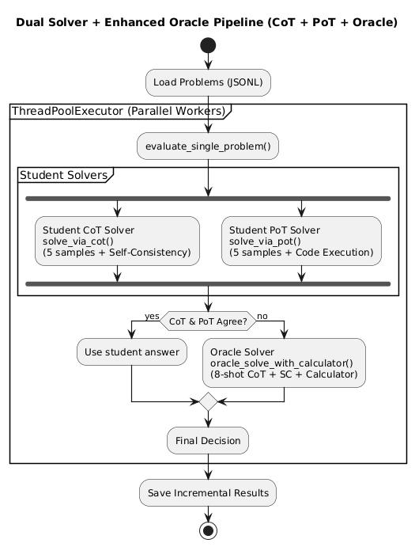

# DSEO: Dual Solver + Enhanced Oracle (Self-Consistency)

`DSEO.py` is a **batch evaluation pipeline** for math/word-problem datasets that combines:

- **Student model** solving with **self-consistency** via:
  - CoT (Chain-of-Thought, natural language reasoning)
  - PoT (Program-of-Thought, Python code generation + execution)
- An **Oracle model** used only when needed:
  - **8-shot CoT prompting**
  - its own **self-consistency**
  - optional “calculator” behavior (executes Python snippets if the model emits them)

The pipeline compares CoT vs PoT outputs:

- If CoT and PoT agree (numeric match), the student answer is accepted.
- If they disagree (or both fail), the oracle is called.

Outputs are written as a single JSON report with per-problem results and summary stats.

## Architecture

## Setup

### 1) Install dependencies

This folder uses `requirements.txt`:

- LangChain client for OpenRouter (`langchain-openai`)
- `.env` support (`python-dotenv`)
- utilities used by other experiments (e.g., `sympy`, `spacy`, etc.)

### 2) Configure OpenRouter access

`DSEO.py` loads environment variables via `python-dotenv` (`load_dotenv()`), so put your key in `LLM-Agent-Research/.env`.

At minimum you need:

- `OPENAI_API_KEY` (OpenRouter API key)

Notes:

- The code uses `base_url="https://openrouter.ai/api/v1"`.
- The model IDs are OpenRouter model slugs.

## Input format

`DSEO.py` expects a **JSONL** file where each line is a JSON object.

For the problem text, it will look for (in this order):

- `problem`
- `input`
- `question`

For the ground-truth (only used for scoring correctness), it tries:

- `answer`
- `output`
- `target`

Ground-truth parsing is numeric-focused and includes best-effort handling for common LaTeX forms (e.g., `\boxed{}`, `\frac{a}{b}`).

## Running DSEO

`DSEO.py` is intended to be run as a script.

### Required arguments

- `--input`: path to input JSONL
- `--output`: path to output JSON

### Common optional arguments

- `--student-model` (default: `meta-llama/llama-3.2-3b-instruct`)
- `--oracle-model` (default: `google/gemma-3-27b-it`)
- `--max-problems` (limit dataset size)
- `--workers` (threaded parallelism; default 10)
- `--num-samples` (student self-consistency samples; default 5)
- `--oracle-samples` (oracle self-consistency samples; default 5)
- `--enable-sc-logging` (include detailed SC traces in output; default disabled)

## Output format

The output is a single JSON file with:

- `config`: run configuration (models, sample counts, strategy string)
- `summary`: aggregate metrics and method breakdown
- `results`: per-problem records

Each element of `results` includes:

- `problem_id`, `question`
- `ground_truth`
- `cot_answer`, `pot_answer`, `final_answer`
- `method`: one of
  - `agreement`
  - `oracle_tiebreaker`
  - `cot_only`
  - `pot_only`
  - `oracle_fallback`
  - `timeout` / `error` (if exceptions occur)
- `oracle_called`: boolean
- `correct`: numeric equality check with tolerance $10^{-6}$
- `reasoning`: the selected reasoning text (CoT reasoning for agreement / CoT-only; oracle reasoning when oracle is used)

If `--enable-sc-logging` is set, each result also contains:

- `self_consistency_log.cot`
- `self_consistency_log.pot`
- `self_consistency_log.oracle`

## Where this fits in the repo

Within `LLM-Agent-Research/` you’ll see multiple solver variants and utilities:

- `DSEO.py`: the main dual-solver + enhanced-oracle pipeline described here.
- `scripts/dual_solver_oracle_cot_enhanced.py`: a closely related (and actively iterated) version of the same idea.
- `scripts/bare_model_benchmark.py`: a minimal “bare model” baseline benchmark.
- `scripts/download_svamp_dataset.py`: helper to export SVAMP-style JSONL.

## Notes & gotchas

- **Long runs / apparent hanging**: oracle calls can be slow. The LLM client uses `request_timeout` (student: 90s, oracle: 120s), and the outer evaluation loop also has stall detection (saves and cancels remaining work if there’s no progress for 300s).
- **Threaded execution**: `--workers` controls concurrency. If you see rate limits or timeouts, reduce it.
- **Numeric-only scoring**: correctness uses numeric extraction. Symbolic answers may not be scoreable.
